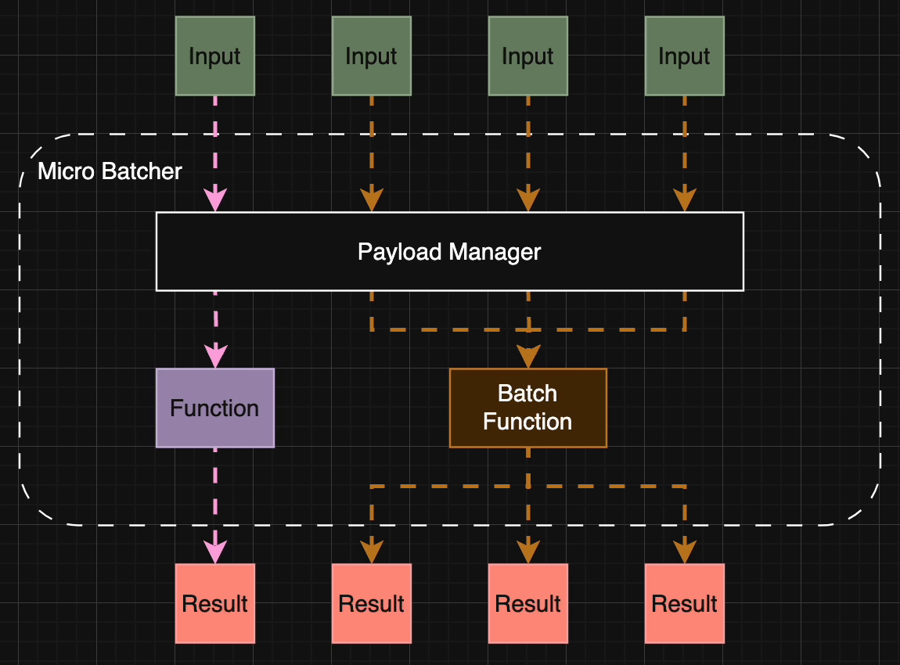

# Micro Batcher

Micro Batcher is a lightweight, zero-dependency, and experimental interval-based micro-batching library for TypeScript/JavaScript.

## Table of Contents

- [Micro Batcher](#micro-batcher)
  - [Table of Contents](#table-of-contents)
  - [Installation](#installation)
  - [Usage](#usage)
  - [Development](#development)
  - [Roadmap](#roadmap)
  - [Contributing](#contributing)
  - [License](#license)
  - [Contact](#contact)

## Installation

```shell
npm install @blackrock-oss/micro-batcher
yarn add @blackrock-oss/micro-batcher
pnpm add @blackrock-oss/micro-batcher
```

## Usage

### Micro Batcher in a nutshell

Micro Batcher is a decorator utility that enhances the input function with additional functionalities such as batching, throttling, and more.

By decorating the original function with Micro Batcher, it produces an enhanced function with the same function signature, allowing developers to seamlessly replace the original function with the enhanced version.

If a batching function is provided to Micro Batcher, calls to the decorated function within a short interval are intercepted, their payloads are accumulated, then forwarded to the batching or original function for processing, and the results are distributed back to the respective callers.



### API Examples

#### Example 1: Single Parameter Function

```typescript
// Original function
const multiplyByTwo = (input: number): Promise<number> => {...};

// Batch resolver function for "multiplyByTwo" function
const batchMultiplyByTwo = (inputs: number[]): Promise<number[]> => {...};

const multiplyByTwoBatcher: (input: number) => Promise<number> =
  MicroBatcher<number, number>(multiplyByTwo)
    .batchResolver(batchMultiplyByTwo)
    .build();
```

#### Example 2: Multiple Parameters Function

```typescript
// Original function
const multiply = (input1: number, input2: number): Promise<number> => {...};

// Batch resolver function for "multiply" function
const batchMultiply = (inputs: [number, number][]): Promise<number[]> => {...};

const multiplyBatcher: (input1: number, input2: number) => Promise<number> =
  MicroBatcher<[number, number], number>(multiply)
    .batchResolver(batchMultiply)
    .build();
```

#### Example 3: Override Default Batching Interval

The default batching interval is 50ms, which can be overridden using `batchingIntervalInMs` in the batch options.

```typescript
const multiplyBatcher: (input1: number, input2: number) => Promise<number> =
  MicroBatcher<[number, number], number>(multiply)
    .batchResolver(batchMultiply, {
      batchingIntervalInMs: 100
    })
    .build();
```

#### Example 4: Specify Payload Window Size Limit

By default, Micro Batcher accumulates all caller payloads based on the batching interval.

However, an optional batch option `payloadWindowSizeLimit` can specify the upper limit of the accumulation size.

Upon reaching the limit, the payloads are immediately delegated to the batch resolver.

```typescript
const multiplyBatcher: (input1: number, input2: number) => Promise<number> =
  MicroBatcher<[number, number], number>(multiply)
    .batchResolver(batchMultiply, {
      payloadWindowSizeLimit: 5
    })
    .build();
```

## Development

### Local Development

```shell
pnpm install
```

### Build

```shell
pnpm run build
```

### Test

```shell
# Run tests
pnpm run test

# Run tests with coverage report
pnpm run test:coverage

# Watch mode
pnpm run test:dev
```

## Roadmap

### Features

- [ ] API Cancellation
- [ ] Concurrent Batcher Limit Support
- [ ] Rate Limiting and Throttling Policies Support

## Contributing

### [Contributing](./CONTRIBUTING.md)

### [Code of Conduct](./CODE_OF_CONDUCT.md)

### [Support](./SUPPORT.md)

## License

Micro Batcher is [Apache Licensed](./LICENSE).

## Contact

GitHub Issues: https://github.com/blackrock/micro-batcher/issues
